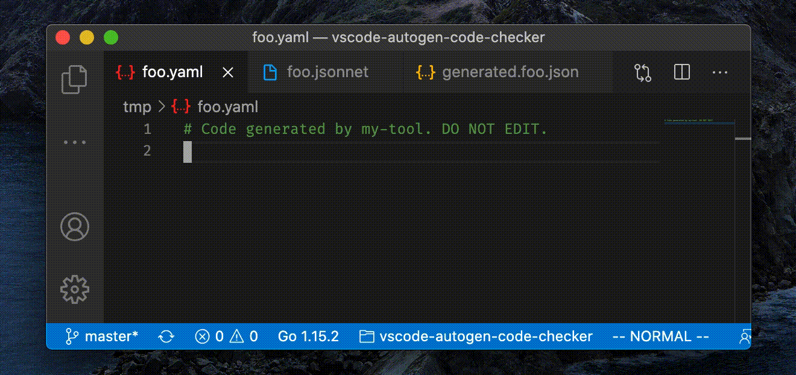

# Autogen Code Checker

This extensions provides verification for files including auto-generated code.

## Features

This extension **shows an error message if a file containing auto-generated code is saved**.

The verification mechanism is based on patterns applied to the [name](#autogencc.patterns.filename) and the [header](#autogencc.patterns.header) of the file.

The default settings include common patterns to figure out if a file is auto-generated or not, but they can be easily extended using the [extension settings](#extension-settings).

## Extension Settings

### `autogencc.patterns.filename`

Patterns to apply to the name of the file in order to identify if the file is auto-generated or not.

Default:

- `generated\\..*`

### `autogencc.patterns.header`

Patterns to apply to the header of the file in order to identify if the file is auto-generated or not.

Default:

- `^(\\/\\/|#+) Code generated( .*)? DO NOT EDIT\\.?$`
